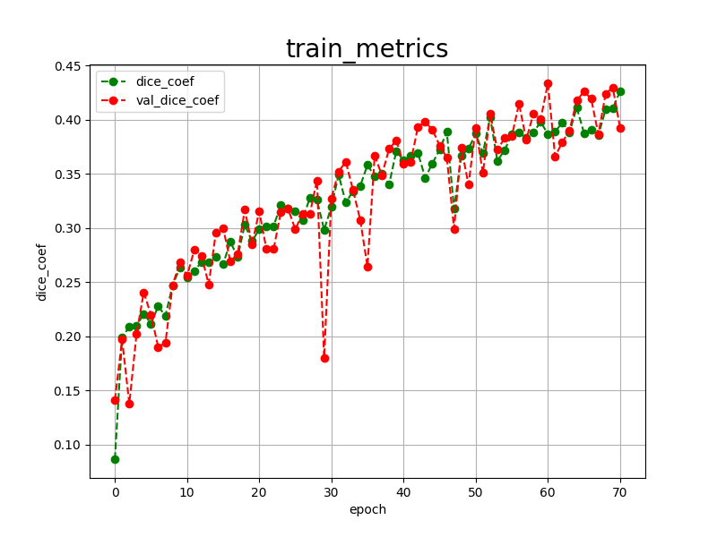
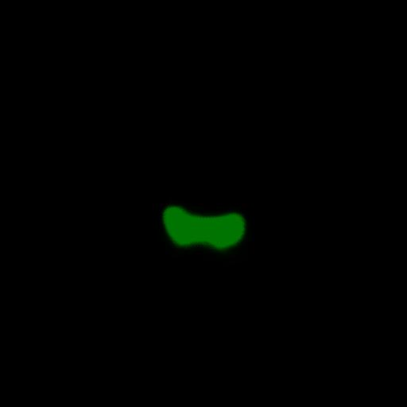
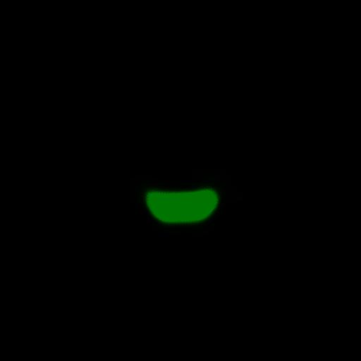

<h2>Tensorflow-Image-Segmentation-Augmented-Nasopharyngeal-Carcinoma-T2WI (Updated: 2024/07/28)</h2>
<li>2024/07/28: Updated train_eval_infer.config.</li>
<li>2024/07/28: Updated <a href="./generator/split_master.py">split_master.py</a> to change output_dir.</li>
 

This is the first experiment of Image Segmentation for <a href="https://zenodo.org/records/10900202">
A dataset of primary nasopharyngeal carcinoma MRI with multi-modalities segmentation
</a>
 based on
the <a href="https://github.com/sarah-antillia/Tensorflow-Image-Segmentation-API">Tensorflow-Image-Segmentation-API</a>,  
In this experiment, we aim to demonstrate that online augmentation of the dataset is effective in improving the generalization performance 
of a deep learning model for image segmentation. 

The original dataset used here was obtained from zenodo.org: <a href="https://zenodo.org/records/10900202">
A dataset of primary nasopharyngeal carcinoma MRI with multi-modalities segmentation. 
</a>
It contains three types of subsets: CE-T1, T1, and T2. In this experiment, for simplicity, 
we focus only on the T2WI subset on training process.

We applied the following image transformation methods to the original dataset to augment them during our training process. 
<ul>
<li>horizontal flipping</li>
<li>vertical flipping</li>
<li>rotation</li>
<li>shrinking</li>
<li>shearing</li>
<li>deformation</li>
<li>distortion</li>
<li>barrel distortion</li> 
</ul>
For more details, please refer to <a href="./src/ImageMaskAugmentor.py">ImageMasukAugmentor.py</a>. 
 

<b>Actual Image Segmentation</b> 
The inferred green-colorized masks predicted by our segmentation model trained on the White-Blood-Cell ImageMaskDataset 
look somewhat similar to the ground truth masks, but they lack precision in certain areas. 
<table>
<tr>
<th>Input: image</th>
<th>Mask (ground_truth)</th>
<th>Prediction: inferred_mask</th>
</tr>
<tr>
<td></td>
<td></td>
<td></td>
</tr>
<tr>
<td></td>
<td></td>
<td></td>
</tr>

<tr>
<td></td>
<td></td>
<td></td>
</tr>
</table>

 
In this experiment, we have used the simple UNet Model 
<a href="./src/TensorflowUNet.py">TensorflowSlightlyFlexibleUNet</a> for this Oral Cancer Segmentation. 
As shown in <a href="https://github.com/sarah-antillia/Tensorflow-Image-Segmentation-API">Tensorflow-Image-Segmentation-API</a>.
you may try other Tensorflow UNet Models: 

<li><a href="./src/TensorflowSwinUNet.py">TensorflowSwinUNet.py</a></li>
<li><a href="./src/TensorflowMultiResUNet.py">TensorflowMultiResUNet.py</a></li>
<li><a href="./src/TensorflowAttentionUNet.py">TensorflowAttentionUNet.py</a></li>
<li><a href="./src/TensorflowEfficientUNet.py">TensorflowEfficientUNet.py</a></li>
<li><a href="./src/TensorflowUNet3Plus.py">TensorflowUNet3Plus.py</a></li>
<li><a href="./src/TensorflowDeepLabV3Plus.py">TensorflowDeepLabV3Plus.py</a></li>

 

<h3>1 Dataset Citation</h3>
The original dataset used here was obtained from zenodo.org: <a href="https://zenodo.org/records/10900202">
A dataset of primary nasopharyngeal carcinoma MRI with multi-modalities segmentation. 
</a> 
<b>Creators</b>
Li, Yin, Chen, Nutan
 
<a href="https://doi.org/10.5281/zenodo.10900202">https://doi.org/10.5281/zenodo.10900202</a> 

<b>Description</b> 
This dataset presents a collection of MRI scans from 277 patients diagnosed with primary Nasopharyngeal Carcinoma (NPC), 
accompanied by radiologists' annotated segmentations. 
Each scan includes T1-weighted, T2-weighted, and contrast-enhanced T1-weighted axial slices, 
providing detailed insights into tumor morphology. The annotations precisely delineate gross tumor 
volume and boundaries. The contemporary clinical and laboratory diagnoses with follow-up survival are contained in the dataset.

Collected with ethical approval, all data is anonymized to ensure privacy and confidentiality. 
For questions please contact Yin Li.
 

<b>Right</b>  
Creative Commons Attribution 4.0 International 
 
Please cite this work as follows: 
<pre>
@misc{li2024dataset,
      title={A dataset of primary nasopharyngeal carcinoma MRI with multi-modalities segmentation}, 
      author={Yin Li and Qi Chen and Kai Wang and Meige Li and Liping Si and Yingwei Guo and Yu Xiong and Qixing Wang and Yang Qin and Ling Xu and Patrick van der Smagt and Jun Tang and Nutan Chen},
      year={2024},
      eprint={2404.03253},
      archivePrefix={arXiv},
      primaryClass={eess.IV}
}
</pre>

 

<h3>2 Nasopharyngeal-Carcinoma-T2WI ImageMask Dataset</h3>
<h3>2.1 Download nasopharyngeal carcinoma MRI dataset</h3>
 If you would like to train this Nasopharyngeal-Carcinoma-T2WI Segmentation model by yourself,
please download the original dataset from zenodo.org:
<a href="https://zenodo.org/records/10900202">
A dataset of primary nasopharyngeal carcinoma MRI with multi-modalities segmentation
</a>
,expanded it, and move the expanded <b>MRI-Segment</b> under <b>./generator</b> directory as shown below. 
<pre>
./generator
├─MRI-Segments
│  ├─001
│  │  ├─CE-T1WI
│  │  ├─T1WI
│  │  └─T2WI
│  ├─002
│  │  ├─CE-T1WI
│  │  ├─T1WI
│  │  └─T2WI
  ...       
├─ImageMaskDatasetGenerator.py
└─split_master.py
</pre>
<h3>2.2 Generate master dataset</h3>

Next, please run the following  command for <a href="./generator/ImageMaskDatasetGenerator.py">ImageMaskDatasetGenerator.py
</a>
<pre>
>python ImageMaskDatasetGenerator.py
</pre> 

The constructor ImageMaskDatasetGenerator in ImageMaskDatasetGenerator.py takes some pamaeters as shown below. 
<pre>
if __name__ == "__main__":

    # Defined resize parameter
    size         = 512
    
    # Enabled exclude_empty_mask flag
    exclude_empty_mask = True
    
    # Specified an angle to rotate a mask.
    mask_rotation   = cv2.ROTATE_90_COUNTERCLOCKWISE

    # Enabled image_normalization flag.
    image_normalize=True

    # Disabled an offline augmentation flag.
    augmentation = False
  
    generator = ImageMaskDatasetGenerator(size = size, 
                                          exclude_empty_mask = exclude_empty_mask,
                                          mask_rotation = mask_rotation,
                                          image_normalize = image_normalize,
                                          augmentation = augmentation)
</pre>
The image_normalize parameter for ImageMaskDatasetGenerator is very significant to generate clear 
images.You may also enable dataset augmentation to generate larger size of dataset. 
<pre>
    augmentation = True
</pre>

<h3>2.3 Split master</h3>
Finally, please run the following command for Python script <a href="./generator/split_master.py">split_master.py</a>
<pre>
>python split_master.py
</pre>
By this command, JPEG <b>Nasopharyngeal-Carcinoma-T2WI</b> dataset will be created under <b>./dataset</b> folder. 

<pre>
./dataset
└─Nasopharyngeal-Carcinoma-T2WI
    ├─test
    │   ├─images
    │   └─masks
    ├─train
    │   ├─images
    │   └─masks
    └─valid
        ├─images
        └─masks
</pre>

<b>Nasopharyngeal-Carcinoma-T2WI Dataset Statistics</b> 
 
 
Given the limited number of images in both the training and validation datasets, as illustrated above, 
an online data augmentation strategy could potentially enhance segmentation accuracy, 
albeit at the cost of increased training time for this segmentation model. 
 

 
<b>Train_images_sample</b> 

 
<b>Train_masks_sample</b> 

 

<h3>3 Train TensorflowUNet Model</h3>
 We have trained Nasopharyngeal-Carcinoma-T2WI TensorflowUNet Model by using the following
<a href="./projects/TensorflowSlightlyFlexibleUNet/Nasopharyngeal-Carcinoma-T2WI/train_eval_infer.config"> <b>train_eval_infer.config</b></a> file.  
Please move to ./projects/Nasopharyngeal-Carcinoma-T2WI and run the following bat file. 
<pre>
>1.train.bat
</pre>
This simply runs the following command. 
<pre>
>python ../../../src/TensorflowUNetTrainer.py ./train_eval_infer.config
</pre>

<pre>
; train_eval_infer.config
; 2024/07/27 (C) antillia.com

[model]
model          = "TensorflowUNet"
generator      = True
image_width    = 512
image_height   = 512
image_channels = 3
input_normalize = False
normalization  = False
num_classes    = 1
base_filters   = 16
base_kernels   = (7,7)
num_layers     = 8
dropout_rate   = 0.05
learning_rate  = 0.0001
clipvalue      = 0.5
dilation       = (1,1)
;loss           = "bce_iou_loss"
loss           = "bce_dice_loss"
;metrics        = ["binary_accuracy"]
metrics        = ["dice_coef"]
show_summary   = False

[train]
epochs        = 100
batch_size    = 2
steps_per_epoch  = 200
validation_steps = 80
patience      = 10

;metrics       = ["iou_coef", "val_iou_coef"]
metrics       = ["dice_coef", "val_dice_coef"]
;metrics       = ["binary_accuracy", "val_binary_accuracy"]

model_dir     = "./models"
eval_dir      = "./eval"
image_datapath = "../../../dataset/Nasopharyngeal-Carcinoma-T2WI/train/images/"
mask_datapath  = "../../../dataset/Nasopharyngeal-Carcinoma-T2WI/train/masks/"

;Inference execution flag on epoch_changed
epoch_change_infer     = True

; Output dir to save the inferred masks on epoch_changed
epoch_change_infer_dir =  "./epoch_change_infer"

;Tiled-inference execution flag on epoch_changed
epoch_change_tiledinfer     = False

; Output dir to save the tiled-inferred masks on epoch_changed
epoch_change_tiledinfer_dir =  "./epoch_change_tiledinfer"

; The number of the images to be inferred on epoch_changed.
num_infer_images       = 1
create_backup  = False

learning_rate_reducer = True
reducer_factor     = 0.3
reducer_patience   = 5
save_weights_only  = True

[eval]
image_datapath = "../../../dataset/Nasopharyngeal-Carcinoma-T2WI/valid/images/"
mask_datapath  = "../../../dataset/Nasopharyngeal-Carcinoma-T2WI/valid/masks/"

[test] 
image_datapath = "../../../dataset/Nasopharyngeal-Carcinoma-T2WI/test/images/"
mask_datapath  = "../../../dataset/Nasopharyngeal-Carcinoma-T2WI/test/masks/"

[infer] 
images_dir    = "./mini_test/images"
output_dir    = "./mini_test_output"

[segmentation]
colorize      = True
black         = "black"
white         = "green"
blursize      = None

[image]
color_converter = None
gamma           = 0

[mask]
blur      = False
blur_size = (3,3)
binarize  = False
;threshold = 128
threshold = 80

[generator]
debug        = False
augmentation = True

[augmentor]
vflip    = True
hflip    = True
rotation = True
angles   = [30, 60, 90, 120, 180, 210, 240, 270, 300,330]
shrinks  = [0.8]
shears   = [0.1]

deformation = True
distortion  = True
sharpening  = False
brightening = False
barrdistortion = True

[deformation]
alpah     = 1300
sigmoids  = [8.0,]

[distortion]
gaussian_filter_rsigma= 40
gaussian_filter_sigma = 0.5
distortions           = [0.02, 0.03]

[barrdistortion]
radius = 0.3
amount = 0.3
centers =  [(0.3, 0.3), (0.7, 0.3), (0.5, 0.5), (0.3, 0.7), (0.7, 0.7)]

[sharpening]
k        = 1.0

[brightening]
alpha  = 1.2
beta   = 10  
</pre>

<b>Model parameters</b> 
Defined small <b>base_filters</b> and large <b>base_kernels</b> for the first Conv Layer of Encoder Block of 
<a href="./src/TensorflowUNet.py">TensorflowUNet.py</a> 
and large num_layers (including a bridge between Encoder and Decoder Blocks).
<pre>
[model]
base_filters   = 16 
base_kernels   = (7,7)
num_layers     = 8
</pre>

<b>Online augmentation</b> 
Enabled our online augmentation.  
<pre>
[model]
model         = "TensorflowUNet"
generator     = True
</pre>

<b>Loss and metrics functions</b> 
Specified "bce_dice_loss" and "dice_coef".
<pre>
[model]
loss           = "bce_dice_loss"
metrics        = ["dice_coef"]
</pre>
<b>Learning rate reducer callback</b> 
Enabled learing_rate_reducer callback. 
<pre> 
[train]
learning_rate_reducer = True
reducer_factor     = 0.3
reducer_patience   = 5
</pre>
<b>Early stopping callback</b> 
Enabled early stopping callback with patience parameter.
<pre>
[train]
patience      = 10
</pre>

<b>Epoch change inference callback</b> 
Enabled EpochChange infer callback.
<pre>
[train]
epoch_change_infer     = True
epoch_change_infer_dir =  "./epoch_change_infer"
num_infer_images       = 1
</pre>

By using this EpochChangeInference callback, on every epoch_change, the inference procedure can be called
 for an image in <b>mini_test</b> folder. This will help you confirm how the predicted mask changes at each epoch during your training process.    

<b>Epoch_change_inference output</b> 
 
 
 
In this case, the training process stopped at epoch 71 by EarlyStopping Callback as shown below. 
<b>Training console output</b> 
 
 
 
<a href="./projects/TensorflowSlightlyFlexibleUNet/Nasopharyngeal-Carcinoma-T2WI/eval/train_metrics.csv">train_metrics.csv</a> 
 

 
<a href="./projects/TensorflowSlightlyFlexibleUNet/Nasopharyngeal-Carcinoma-T2WI/eval/train_losses.csv">train_losses.csv</a> 
 

 

<h3>4 Evaluation</h3>
Please move to a <b>./projects/TensorflowSlightlyFlexibleUNet/Nasopharyngeal-Carcinoma-T2WI</b> folder, 
and run the following bat file to evaluate TensorflowUNet model for Nasopharyngeal-Carcinoma-T2WI. 
<pre>
./2.evaluate.bat
</pre>
This bat file simply runs the following command.
<pre>
python ../../../src/TensorflowUNetEvaluator.py ./train_eval_infer_aug.config
</pre>

<b>Evaluation console output</b> 

  

<a href="./projects/TensorflowSlightlyFlexibleUNet/Nasopharyngeal-Carcinoma-T2WI/evaluation.csv">evaluation.csv</a> 

The loss (bce_dice_loss) for this test is  not so low, and dice_coef not high. 
<pre>
loss,0.3294
dice_coef,0.3977
</pre>

Previous result: 
<pre>
loss,0.3383
dice_coef,0.3766
</pre>

<h3>
5 Inference
</h3>
Please move to a <b>./projects/TensorflowSlightlyFlexibleUNet/Nasopharyngeal-Carcinoma-T2WI</b> folder 
,and run the following bat file to infer segmentation regions for images by the Trained-TensorflowUNet model for Nasopharyngeal-Carcinoma-T2WI. 
<pre>
./3.infer.bat
</pre>
This simply runs the following command.
<pre>
python ../../../src/TensorflowUNetInferencer.py ./train_eval_infer_aug.config
</pre>

<b>mini_test_images</b> 
 
<b>mini_test_mask(ground_truth)</b> 
 

<b>Inferred test masks</b> 
 
 

<b>Enlarged Images and Masks Comparison</b> 
<table>
<tr>
<th>Image</th>
<th>Mask (ground_truth)</th>
<th>Inferred-mask</th>
</tr>

<tr>
<td></td>
<td></td>
<td></td>
</tr>

<tr>
<td></td>
<td></td>
<td></td>
</tr>

<tr>
<td></td>
<td></td>
<td></td>
</tr>

<tr>
<td></td>
<td></td>
<td></td>
</tr>

<tr>
<td></td>
<td></td>
<td></td>
</tr>

</table>

 
 

<h3>
Reference
</h3>
<b>1. A dataset of primary nasopharyngeal carcinoma MRI with multi-modalities segmentation</b> 
Yin Li and Qi Chen and Kai Wang and Meige Li and Liping Si and Yingwei Guo and Yu Xiong  
and Qixing Wang and Yang Qin and Ling Xu and Patrick van der Smagt and Jun Tang and Nutan Chen 
<a href="https://doi.org/10.5281/zenodo.10900202">https://doi.org/10.5281/zenodo.10900202</a> 
<a href="https://zenodo.org/records/10900202">https://zenodo.org/records/10900202</a>
 
